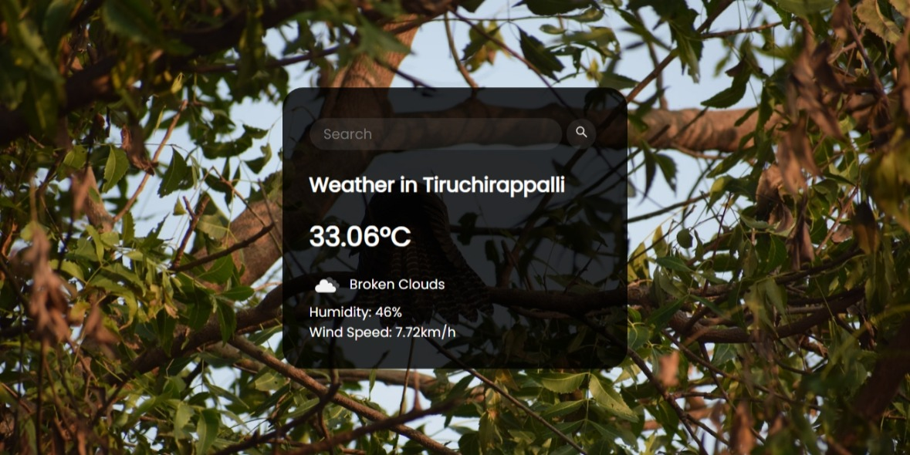

# CloudFlex


The weather app using HTML, CSS, and JavaScript to use the OpenWeatherMap API to display the current weather in locations around the world.
Background image uses unsplash API to generate relevant image based off city name.


## Demo

.

## Features

- Get the current weather conditions for a specific location.
- View a 5-day weather forecast for the chosen location.
- Display weather information such as temperature, humidity, wind speed, and description.
- Search for weather data in different cities around the world.
- Responsive design for seamless viewing on different devices.

## Technologies Used

- HTML
- CSS
- OpenWeatherMap API

## Installation

Linux and macOS:

```bash
sudo git clone https://github.com/PrakasRavichandran/CloudFlex.git
```

Windows:

```bash
git clone https://github.com/PrakasRavichandran/CloudFlex.git
```

## Contact

If you want to contact me you can reach me at [Instagram](https://www.instagram.com/prakashravichandrann/).

## License

This project is **free to use** and does not contain any license.
